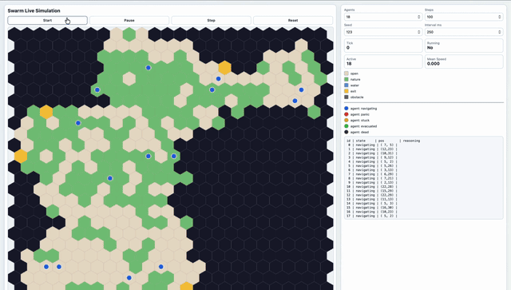
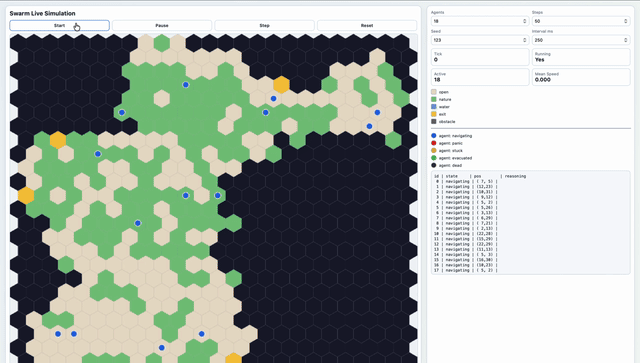

# SWARM — Spatial Waypoint Agent Routing Machine

> A pixel-granularity spatial AI simulation engine for multi-agent navigation, evacuation modeling, traffic flow analysis, and urban planning scenarios.

## What Is This?

SWARM is a simulation engine where thousands of autonomous agents navigate a spatial environment represented as a **pixel grid with rich metadata**. Each pixel knows what it's on (terrain), what's in it (obstacles, agents, hazards), and what's next to it (neighbors) — enabling fully **local decision-making** that produces emergent global behavior.

Think of it as the intersection of:
- **Agent-Based Modeling** (Mesa, NetLogo) — but with ML-enhanced decisions
- **Swarm Intelligence** (Boids, ACO, PSO) — but with shared spatial memory
- **Operations Research** (A*, simulated annealing) — but distributed across agents
- **Multi-Agent, Multi-Generational Reinforcement Learning** — but grounded in physical space

## Use Cases

| Scenario | What It Models |
|----------|---------------|
| 🌊 Flood Response | Rising water levels reshape passable terrain in real-time |
| 🔥 Fire Evacuation | Agents flee a spreading hazard through corridors with panic dynamics |
| 🚗 Traffic Flow | Vehicles as agents on road networks, finding chokepoints |
| 🏗️ Construction Impact | Block areas and measure walkability/transit degradation |
| 🎪 Event Congestion | Concert/festival crowds straining infrastructure |
| 🏥 Emergency Response | Ambulance routing through dynamic traffic |

## Flood Response Demo

<p align="center">
  
  <br>
  <em>First Generation Flood Response</em>
</p>

<p align="center">
  
  <br>
  <em>Second Generation Flood Response</em>
</p>

## Architecture

```
┌────────────────────────────────────────────────────────────┐
│                    SCENARIO CONFIG                         │
│  (YAML: map, agents, hazards, objectives, parameters)      │
└──────────────────────┬─────────────────────────────────────┘
                       │
┌──────────────────────▼─────────────────────────────────────┐
│                  SIMULATION ENGINE                         │
│  ┌──────────┐  ┌──────────┐  ┌─────────────────────────┐   │
│  │  World   │  │  Tick    │  │   Event / Hazard        │   │
│  │  Grid    │  │  Clock   │  │   Scheduler             │   │
│  └────┬─────┘  └────┬─────┘  └──────────┬──────────────┘   │
│       │             │                   │                  │
│  ┌────▼─────────────▼───────────────────▼──────────────┐   │
│  │              SPATIAL FIELD LAYER                    │   │
│  │  • Terrain costs   • Pheromone maps                 │   │
│  │  • Danger fields   • Flow gradients                 │   │
│  │  • Occupancy grid  • Goal attractors                │   │
│  └────────────────────┬────────────────────────────────┘   │
│                       │                                    │
│  ┌────────────────────▼────────────────────────────────┐   │
│  │              AGENT SWARM LAYER                      │   │
│  │                                                     │   │
│  │  ┌─────────┐  Each agent has:                       │   │
│  │  │ Agent_i │  • Position (x, y)                     │   │
│  │  │         │  • Velocity / heading                  │   │
│  │  │ ┌─────┐ │  • Personality (risk, speed, panic)    │   │
│  │  │ │Brain│ │  • Local perception (NxN neighborhood) │   │
│  │  │ └──┬──┘ │  • Decision module (pluggable)         │   │
│  │  └────┼────┘  • Memory (visited, pheromones seen)   │   │
│  │       │                                             │   │
│  │  Decision Pipeline:                                 │   │
│  │  1. PERCEIVE  → read local pixel neighborhood       │   │
│  │  2. EVALUATE  → score options via utility function  │   │
│  │  3. DECIDE    → pick action (stochastic softmax)    │   │
│  │  4. ACT       → move / wait / signal                │   │
│  │  5. DEPOSIT   → leave pheromone / update shared mem │   │
│  └─────────────────────────────────────────────────────┘   │
│                                                            │
│  ┌─────────────────────────────────────────────────────┐   │
│  │           SHARED CONTEXT PIPELINE                   │   │
│  │  • Stigmergy (pheromone trails on grid)             │   │
│  │  • Broadcast signals (fire alarm, congestion alert) │   │
│  │  • Gradient fields (computed each tick)             │   │
│  │  • Blackboard (global shared key-value store)       │   │
│  └─────────────────────────────────────────────────────┘   │
└──────────────────────┬─────────────────────────────────────┘
                       │
┌──────────────────────▼─────────────────────────────────────┐
│                   ANALYTICS & VIZ                          │
│  • Real-time heatmaps    • Evacuation time curves          │
│  • Flow vectors          • Chokepoint detection            │
│  • Agent trajectory logs • Scenario comparison             │
└────────────────────────────────────────────────────────────┘
```

## How to Run

Add a `env` file with an `API_KEY` for an OpenAI Client and a `BASE_URL`. See .env.example for details. We recomment Doubleword!

```bash
pixi run python -m sim.web --host 127.0.0.1 --port 8765 --config baseline.yaml
```

## Key Design Principles

### 1. Pixel-as-World-State
Every pixel is a `Cell` with metadata:
```python
Cell(
    terrain="corridor",     # what it's ON
    walkable=True,          # can agents traverse it?
    cost=1.0,               # movement cost multiplier
    contents=[],            # what's IN it (agents, items)
    hazard_level=0.0,       # danger (fire, flood depth)
    pheromone={},           # stigmergic signals
    elevation=0.0,          # for flood modeling
    neighbors=[]            # spatial connectivity
)
```

### 2. Stochastic Agent Personalities
No two agents are alike. Each draws from configurable distributions:
```python
personality = AgentPersonality(
    speed=Normal(μ=1.0, σ=0.2),        # movement speed
    risk_tolerance=Beta(α=2, β=5),      # how danger-averse
    panic_threshold=Uniform(0.3, 0.8),  # when panic kicks in
    herding_tendency=Beta(α=3, β=2),    # follow-the-crowd strength
    patience=Exponential(λ=0.1),        # how long before rerouting
)
```

### 3. Three-Layer Decision Architecture
Inspired by Rodney Brooks' subsumption + operations research:

| Layer | Frequency | Mechanism | Example |
|-------|-----------|-----------|---------|
| **Reactive** | Every tick | Social Force Model | Avoid collisions, walls |
| **Tactical** | Every N ticks | Local A* / gradient descent | Route to next waypoint |
| **Strategic** | On trigger | Simulated annealing / MCTS | Replan entire path |

### 4. Shared Context Pipeline (Stigmergy + Blackboard)
Agents communicate **indirectly** through the environment:
- **Pheromone trails**: Agents deposit "been here" / "danger here" / "exit this way" signals that decay over time (ACO-inspired)
- **Gradient fields**: Pre-computed goal-distance fields that agents read locally
- **Blackboard**: Global shared state for system-level events (fire alarm triggered, road closed)
- **Broadcast radius**: Agents can emit local signals sensed by neighbors within range

### 5. Optimization Techniques

| Technique | Where Used |
|-----------|-----------|
| **A\* / D\*** | Individual pathfinding on the grid |
| **Simulated Annealing** | Strategic re-routing under congestion |
| **Ant Colony Optimization** | Pheromone-based collective route discovery |
| **Particle Swarm Optimization** | Tuning simulation hyperparameters |
| **Social Force Model** | Reactive collision avoidance |
| **Monte Carlo Tree Search** | Evaluating multi-step action sequences |
| **Game Theory (Nash)** | Modeling competitive resource access (exits) |

## Quick Start

```bash
# Install
pip install -e .

# Run a fire evacuation scenario
python -m swarm.cli run scenarios/fire_evacuation.yaml

# Run with visualization
python -m swarm.cli run scenarios/fire_evacuation.yaml --viz

# Run parameter sweep
python -m swarm.cli sweep scenarios/fire_evacuation.yaml --param agents.count=100,500,1000
```

## Project Structure

```
swarm/
├── core/                   # Simulation engine
│   ├── world.py            # Grid world, cells, spatial fields
│   ├── clock.py            # Tick-based simulation clock
│   ├── engine.py           # Main simulation loop
│   └── events.py           # Hazard/event scheduling
├── agents/                 # Agent framework
│   ├── base.py             # Base agent class
│   ├── personality.py      # Stochastic personality traits
│   ├── perception.py       # Local neighborhood sensing
│   ├── decisions/          # Decision modules (pluggable)
│   │   ├── reactive.py     # Social Force Model layer
│   │   ├── tactical.py     # A*/gradient route planning
│   │   └── strategic.py    # SA/MCTS replanning
│   └── swarm.py            # Swarm manager
├── shared/                 # Shared context pipeline
│   ├── pheromones.py       # Stigmergic pheromone system
│   ├── fields.py           # Gradient & potential fields
│   └── blackboard.py       # Global shared state
├── scenarios/              # Scenario configurations
│   ├── fire_evacuation.yaml
│   ├── flood_response.yaml
│   ├── traffic_flow.yaml
│   └── event_congestion.yaml
├── analytics/              # Output analysis
│   ├── metrics.py          # KPIs (evacuation time, throughput)
│   ├── heatmap.py          # Spatial usage heatmaps
│   └── recorder.py         # Trajectory & event logging
├── viz/                    # Visualization
│   └── renderer.py         # Pygame/matplotlib renderer
├── cli.py                  # Command-line interface
└── config.py               # Configuration loader
```

## Research Foundations

This system synthesizes ideas from:

| Source | Contribution |
|--------|-------------|
| **Helbing & Molnár (1995)** — Social Force Model | Reactive pedestrian forces |
| **Reynolds (1987)** — Boids | Separation, alignment, cohesion |
| **Dorigo (1992)** — Ant Colony Optimization | Pheromone-based stigmergy |
| **Vicsek et al. (1995)** — Self-Propelled Particles | Noise-driven alignment |
| **Reif & Wang (1999)** — Social Potential Fields | Attraction/repulsion force laws |
| **Mesa Framework** — Python ABM | Grid architecture, PropertyLayers |
| **SUMO** — Traffic Simulation | Road network agent modeling |
| **Generative Agents (Park et al. 2023)** | LLM-enhanced agent reasoning |

## Innovation: What's New Here

1. **Pixel-metadata-driven local decisions**: Each cell carries rich semantic data, not just passability. Agents reason about *what kind of space* they're in.

2. **Stochastic personality swarms**: Population-level distributions create realistic heterogeneity — some agents panic, some stay calm, some follow crowds, some break away.

3. **Three-tier decision fusion**: Reactive avoidance + tactical routing + strategic replanning, each operating at different timescales, fused via priority arbitration.

4. **Stigmergy-first communication**: Agents primarily communicate through the environment itself (like ants), creating emergent collective intelligence without explicit messaging.

5. **Pluggable decision modules**: Swap between rule-based, optimization-based, or ML-based decision making per layer. Train a neural tactical planner and drop it in.

6. **Scenario-as-config**: Define entire simulations in YAML — maps, agent populations, hazard schedules, objectives — making it easy to A/B test interventions.

## License

MIT
